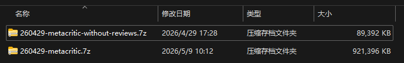

# metacritic-harvester 中文说明

[English README](../../README.md) | [使用方式](./usage.md) | [Serve](./serve.md)


[](https://goreportcard.com/report/github.com/gofurry/metacritic-harvester)

## 成功抓取截图

下图展示了抓取成功后，包含完整数据的压缩包截图。



一个本地优先的 Go 工具集，用来采集公开的 Metacritic 榜单、详情和评论数据，并写入 SQLite。

## 它能做什么

`metacritic-harvester` 主要用于本地采集、保存和使用公开的 Metacritic 数据。

当前已经支持：

- 采集游戏、电影、电视剧榜单
- 采集作品详情页
- 采集评论家与用户评论
- 使用 SQLite 保存当前态视图和不可变快照
- 为 `latest`、`detail`、`review` 提供查询、导出和对比命令
- 默认采用 `API-first` 抓取，在仍有价值的地方保留 HTML fallback
- 通过 CLI 执行本地 batch 和 schedule
- 运行本地 `serve` 服务和嵌入式运维控制台

## 核心命令

- `crawl list`
- `crawl detail`
- `crawl reviews`
- `crawl batch`
- `crawl schedule`
- `serve`
- `latest query / export / compare`
- `detail query / export / compare`
- `review query / export / compare`

存储与历史：

- `works`
- `crawl_runs`
- `list_entries`
- `latest_list_entries`
- `work_details`
- `work_detail_snapshots`
- `detail_fetch_state`
- `latest_reviews`
- `review_snapshots`
- `review_fetch_state`

运行时行为：

- `crawl list` 和 `crawl detail` 支持 `--source=api|html|auto`
- `crawl list`、`crawl detail` 和 `crawl reviews` 都支持 `--timeout`
- `crawl list`、`crawl detail` 和 `crawl reviews` 都支持 `--continue-on-error`
- `crawl list`、`crawl detail` 和 `crawl reviews` 都支持 `--rps` 和 `--burst`
- 默认 source 是 `api`
- 默认抓取超时是 `3h`
- 默认抓取速率限制是 `2 RPS`，`burst=2`
- `crawl list`、`crawl detail` 和 `crawl reviews` 默认都是 `--continue-on-error=true`
- `auto` 表示“先尝试 API，失败后再回退”
- detail 的 enrich 仅在 API 路径没有完全覆盖字段时才使用 HTML / Nuxt
- `serve` 支持浏览器直接下载导出结果
- 即使启用 web 控制台，batch 和 schedule 仍然由 CLI 驱动

## 快速开始

```bash
go run ./cmd/metacritic-harvester crawl list --category=game --metric=metascore --source=api --pages=0 --db=output/metacritic.db
go run ./cmd/metacritic-harvester crawl detail --db=output/metacritic.db --category=game --source=api
go run ./cmd/metacritic-harvester crawl reviews --db=output/metacritic.db --category=game --review-type=critic
go run ./cmd/metacritic-harvester detail query --db=output/metacritic.db --category=game
go run ./cmd/metacritic-harvester serve --db=output/metacritic.db --full-stack --enable-write
```

默认抓取语义：

- `pages=0` 表示抓取全部榜单页
- `limit=0` 表示处理全部详情或评论候选作品
- `--concurrency` 控制 worker 数，`--rps` / `--burst` 控制共享请求限流
- 默认会把部分失败计入 summary 并继续运行；只有传入 `--continue-on-error=false` 才会恢复遇错即停
- 默认命令级超时是 `3h`，可以用 `--timeout` 覆盖

## Release 构建

使用仓库根目录的构建脚本生成预编译二进制：

```bat
build.bat
```

构建产物会输出到：

- `output/releases`

当前包含这些目标平台：

- `windows/amd64`
- `windows/arm64`
- `linux/amd64`
- `linux/arm64`
- `darwin/amd64`
- `darwin/arm64`

产物命名遵循下面的格式：

- `metacritic-harvester_windows_amd64.exe`
- `metacritic-harvester_linux_arm64`

构建脚本使用了偏向减小体积的 Go 参数：

- `-trimpath`
- `-ldflags "-s -w -buildid="`
- `CGO_ENABLED=0`

## Serve 亮点

内置本地服务当前支持：

- 本地 JSON API
- 嵌入式 Vue 控制台
- 基于 SSE 的实时采集日志
- 直接发起 `list / detail / reviews` 任务
- `latest / detail / review` 的浏览器下载导出

当前 serve 的边界：

- 默认绑定 `127.0.0.1`
- 默认只读
- 写操作需要显式加 `--enable-write`
- batch 和 schedule 保持在 CLI 侧，web 控制台只说明这部分工作流，不通过 HTTP 直接触发

## 推荐阅读

- [使用方式](./usage.md)
- [Serve 说明](./serve.md)
- [批量任务](./batch-tasks.md)
- [调度说明](./scheduling.md)
- [过滤参数](./filters.md)
- [榜单读侧](./latest.md)

## 工具链

如果需要重新生成数据库访问代码，先安装 `sqlc`：

```bash
go install github.com/sqlc-dev/sqlc/cmd/sqlc@latest
sqlc generate
```

运行测试：

```bash
go test ./...
```
